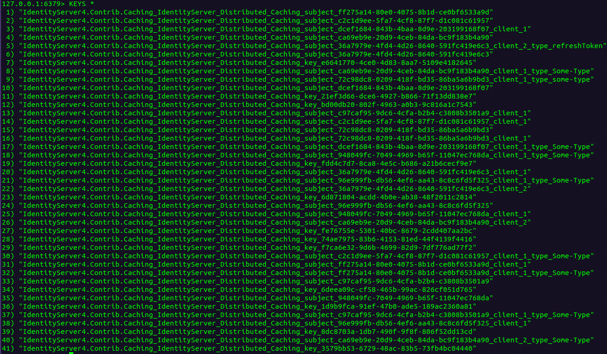

# IdentityServer4.Contrib.Caching

## IdentityServer4.Contrib.Caching.Redis

[](https://www.nuget.org/packages/IdentityServer4.Contrib.Caching.Redis)
[](https://www.nuget.org/packages/IdentityServer4.Contrib.Caching.Redis)
[](https://travis-ci.com/cleancodelabs/IdentityServer4.Contrib.Caching)

This library is written in .netstandard2.0 and provides an implementation of `IPersistedGrantStore` for `IdentityServer4` using the `IDistributedCache` interface and Redis implementation located in [Microsoft.Extensions.Caching.StackExchangeRedis](https://www.nuget.org/packages/Microsoft.Extensions.Caching.StackExchangeRedis/2.2.5), that can easily be registered using provided extension methods for `IIdentityServerBuilder`.

It also used [RedLock](https://www.nuget.org/packages/RedLock/) for pessimistic locking of resources in Redis.

## How it works

`IdentityServer4` provides an interface called `IPersistedGrantStore` located in the package [IdentityServer4.Stores](https://github.com/IdentityServer/IdentityServer4/blob/314bb5a9f05a296d4ab375e02451ff0a9e9c7bac/src/Storage/src/Stores/IPersistedGrantStore.cs#L14).
Any store can be registered using a simple extensions method provided by `IdentityServer4`. This package makes use of it and implements a store that is distributed and can therefor be easily used in a load-balanced environment.

There are four keyed combinations stored:

* Key of `PersistedGrant`
* Subject-Id of `PersistedGrant`
* Combination of Subject- and Client-Id of `PersistedGrant`
* Combination of Subject-, Client-Id and Type of `PersistedGrant`

While a key is unique and therefor only stored as a single object, all other combinations are not. For instance a given subject-id can be a user-id and a user might log into services using multiple front-ends. Those instances are appended and that's where `RedLock` kicks in.
To ensure that no values are overwritten, `RedLock` is used to temporally lock the resource that is then loaded, appended, released and stored.   



## Installation

This package is available via nuget. You can install it using Visual-Studio-Nuget-Browser or by using the dotnet-cli.

dotnet add package IdentityServer4.Contrib.Caching.Redis
If you want to add a specific version of this package

dotnet add package IdentityServer4.Contrib.Caching.Redis --version 1.0.0
For more information please visit the official dotnet-cli documentation.

## Usage

Only thing you need to do is call an extension method on the `IIdentityServerBuilder` that you are already using.

```csharp
public void ConfigureServices(IServiceCollection services)
{
    services.AddIdentityServer()
        // more code here
        .AddDistributedRedisCache(configuration: "127.0.0.1:6379", instanceName: "my-redis-instance-name"); // <- this!
        
    // more code here 
}
```

Optionally you can pass in a caching prefix. The default is "_IdentityServer_Distributed_Caching_".

```csharp
public void ConfigureServices(IServiceCollection services)
{
    services.AddIdentityServer()
        // more code here
        .AddDistributedRedisCache(configuration: "127.0.0.1:6379", instanceName: "my-redis-instance-name", 
            cachingPrefix: "_my-identityserver-caching-prefix_); // <- this!
        
    // more code here 
}
```

You can also pass in your on configuration-builder for `RedisCacheOptions` and `RedisCacheGrantStoreConfiguration`

```csharp
public void ConfigureServices(IServiceCollection services)
{
    services.AddIdentityServer()
        // more code here
        .AddDistributedRedisCache(options =>  // <- this!
            {
            options.Configuration: "127.0.0.1:6379";
            options.InstanceName: "my-redis-instance-name";
            }, 
            options => options.CachingPrefix = "_my-identityserver-caching-prefix_");
        
    // more code here 
}
```

Third option also allows you to configure the `RedLockOptions` to configure the retry-count and retry-timeout.

```csharp
public void ConfigureServices(IServiceCollection services)
{
    services.AddIdentityServer()
        // more code here
        .AddDistributedRedisCache(options =>  // <- this!
            {
            options.Configuration: "127.0.0.1:6379";
            options.InstanceName: "my-redis-instance-name";
            }, 
            options => options.CachingPrefix = "_my-identityserver-caching-prefix_",
            options => 
            {
                options.LockRetryCount = 1,
                options.LockRetryDelay = TimeSpan.FromSeconds(1)
            });
        
    // more code here 
}
```

That's it! You are good to go and everything required to use `IDistributedCache` for Redis and IdentityServer has been setup.

For more details and information, have a look at the [tests](test/IdentityServer4.Contrib.Caching.Redis.Tests).